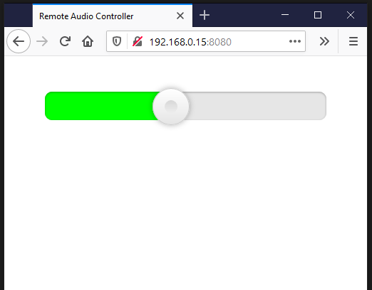

# http-remote-audio-control
Simple http service that allows to control system volume.
You can control your PC's volume from your smartphone's web browser.

Compilation:
1. Run init.ps1 (requires npm)
2. Restore NuGet packages
3. Compile

Usage:
-p, --port (Default: 8080) Port

e.g.:
RemoteAudioController.exe -p 8080

